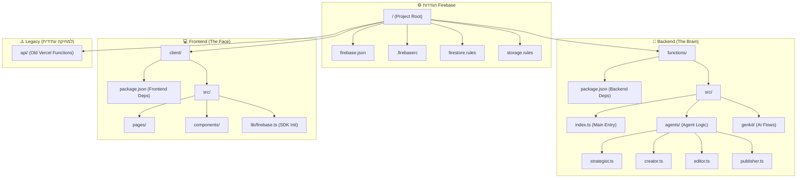

# מבנה הפרויקט המומלץ: CargoNex AI Agency (Firebase Architecture)

מסמך זה מציג את השינוי המבני הנדרש כדי לעבור מארכיטקטורת Vercel (Client + API) לארכיטקטורת Firebase (Client + Cloud Functions/Genkit).

---

## 📂 תרשים המבנה החדש (Proposed Directory Tree)

---

## 📝 פירוט התיקיות והקבצים

### 1. שורש הפרויקט (`/`)

כאן יושבים קבצי הקונפיגורציה שמנהלים את כל ה"מונוריפו" (Monorepo) הזה.

* **`firebase.json`**: הקובץ החשוב ביותר. מגדיר איפה יושב ה-Frontend (`client/dist`), איפה ה-Backend (`functions`), ואיזה אמולטורים להריץ.
* **`firestore.rules`**: חוקי האבטחה של מסד הנתונים (מי יכול לקרוא/לכתוב).
* **`.firebaserc`**: שיוך הפרויקט המקומי לפרויקט בענן (`cargonex-ai-agency`).

### 2. המוח (`/functions`)

זוהי תיקייה חדשה לחלוטין שתיווצר על ידי `firebase init`. היא מתפקדת כפרויקט Node.js עצמאי לחלוטין.

* **`package.json`**: יכיל ספריות שרת בלבד (כמו `firebase-admin`, `genkit`, `@google/genai`).
* **`src/agents/`**: כאן נכתוב את הלוגיקה של כל אייג'נט בנפרד.
* **`src/index.ts`**: נקודת הכניסה. כאן נגדיר את ה-Triggers (למשל: "כשנוצר מסמך ב-Firestore -> תפעיל את האסטרטג").

### 3. הפנים (`/client`)

זוהי אפליקציית ה-Vite הקיימת שלך. השינויים כאן יהיו מינוריים:

* **`src/lib/firebase.ts`**: קובץ חדש שיאתחל את החיבור ל-Firebase.
* **מחיקת קריאות API**: במקום `fetch('/api/generate')`, נשתמש בפונקציות כמו `addDoc(collection(db, 'campaigns'), { ... })`.

### 4. הישן (`/api`)

תיקייה זו תישאר זמנית כ-Reference (כדי שנוכל להעתיק ממנה את ה-Prompts הקיימים), אך היא לא תהיה פעילה במערכת החדשה.

---

## ⚖️ השוואה: מה משתנה?

| | מבנה נוכחי (Vercel) | מבנה חדש (Firebase) |
| :--- | :--- | :--- |
| **Backend** | תיקיית `/api` עם קבצים בודדים | תיקיית `/functions` שהיא פרויקט שלם |
| **Database** | אין (Stateless) | Firestore (מוגדר בשורש) |
| **תקשורת** | HTTP Requests (REST) | Firestore Listeners (Real-time) |
| **AI** | קריאה ישירה בתוך ה-API | Genkit Flows בתוך ה-Functions |

---

### השלב הבא המומלץ

1. יצירת ה-Branch החדש.
2. הרצת `firebase init` שתיצור את המבנה הזה (בעיקר את תיקיית `functions` ואת קבצי ה-JSON בשורש).
3. הזזת התיקייה `client` (היא כבר במקום הנכון, רק צריך לוודא ש-Firebase "מכיר" אותה).
